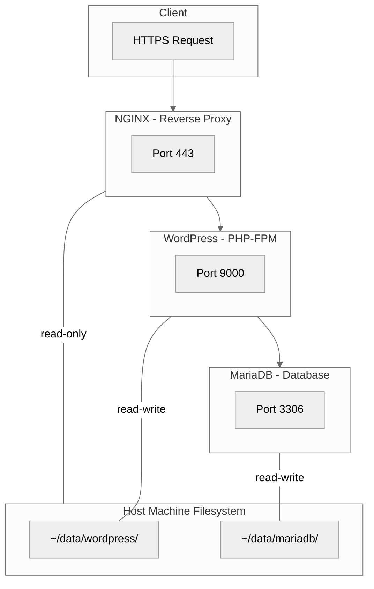

# Inception

A fully containerized WordPress environment powered by Docker Compose. This project orchestrates a multi-container setup featuring Nginx, MariaDB, and WordPress, all configured for security, persistence, and automated deployment.

***

## Core Features

* **One-Command Setup**: A `Makefile` automates the entire process. Just run `make`.
* **Secure by Design**: Uses Docker Secrets for password management, runs services as unprivileged users, and configures Nginx with a read-only volume.
* **Fully Automated**: Scripts generate randomized passwords, user/database names, and self-signed SSL certificates on first run.
* **Persistent Data**: WordPress files and MariaDB database are stored directly on host machine inside `~/data/`. This is achieved using Docker bind mounts, meaning your data survives even if the containers are completely removed (`make clean`) or rebuilt.
* **Clean & Isolated**: All services run in isolated containers on a custom bridge network, preventing conflicts.

***

## 🏗️ Project Architecture

The application consists of three main services orchestrated by Docker Compose:




* **Nginx**: The public-facing entry point. It serves static content, terminates SSL/TLS, and acts as a reverse proxy, forwarding PHP requests to the WordPress service.
* **WordPress**: Runs the core application using PHP-FPM. It communicates with the MariaDB container for all database operations and uses WP-CLI for a fully automated, non-interactive installation.
* **MariaDB**: The dedicated database server for the WordPress installation.

***

## 🛠️ Prerequisites

Before you begin, ensure you have the following installed:
* **Docker Engine**
* **Docker Compose**
* **Make**

***

## 🏁 Quick Start

1.  **Clone the repository:**
    ```bash
    git clone https://github.com/lnemenl/Inception.git
    cd Inception
    ```

2.  **Build and run the application:**
    ```bash
    make
    ```
    The first time you run this, a setup script will generate all necessary configurations and secrets. You will see a summary with your domain and credentials once it's ready.

3.  **Access your site:**
    Open your browser and navigate to the URL provided in the output (e.g., `https://your-login.42.fr`).

***

## ⚙️ Makefile Commands

A convenient `Makefile` is included to manage the application's lifecycle.

| Command        | Description                                                                          |
| -------------- | ------------------------------------------------------------------------------------ |
| `make help`    | Displays a list of all available commands                                            |

***
